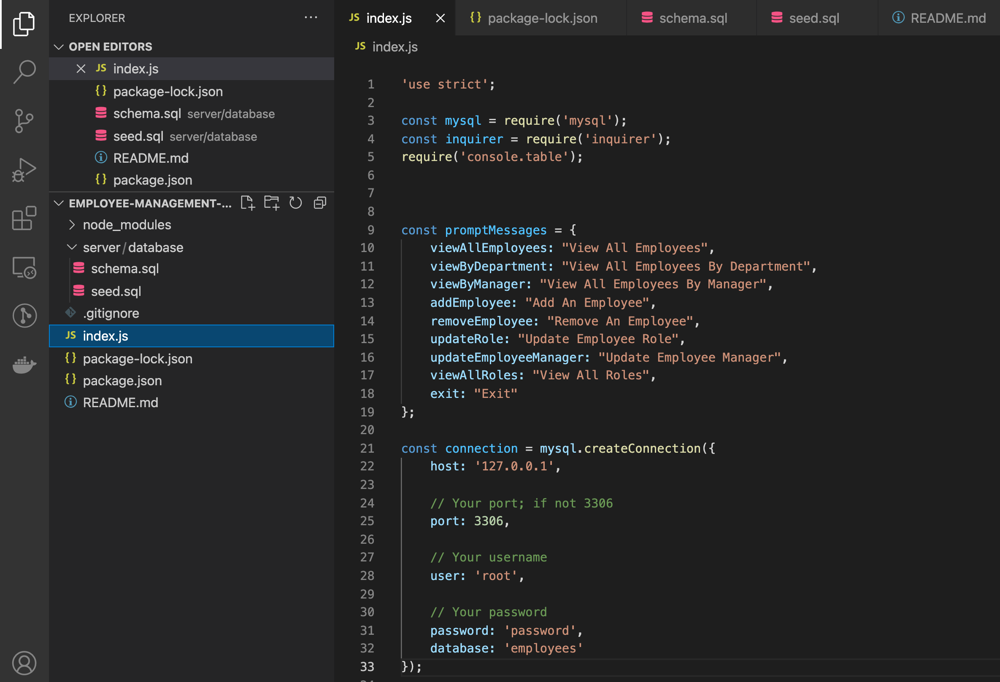

  
  # Employee Tracking with MYSQL

  Staff database using MySQL and Node.js

  

  
---
  ## Contents

  1. [About](#about)
      1. [User Story](#user%20story)
      2. [Acceptance criteria](#acceptance%20criteria)
      3. [Visuals](#visuals)
      4. [Build](#build)
  2. [Installation](#installation)
  3. [License](#license)
  4. [Contributing](#contributing)
  5. [Tests](#tests)
  6. [Authors and acknowledgment](#authors%20and%20acknowledgment)

---
  ## About

  Track, store and update your employees salary, managers, departments and more.
  
  
---
  ## Visuals:

  

  [Browser based Video Walkthrough. Click Download/View Raw to display](./images-video/Employee-Management.mp4)

---

  ## Installation:
  * Clone repositry onto your machine. 
  * Type `cd employee-management-system` in your terminal to go to that folder. 
  * In terminal type `npm install`. You are all set and ready to start. 
  * Type `node index.js` in your terminal to start application.

  To clone the repo:
  
      git clone git@github.com:Invogue01/employee-management-system.git
  
---

  ## License
  License used for this project - GNU AGPLv3
  * For more information on license types, please reference this website
  for additional licensing information - [https: //choosealicense.com/](https://choosealicense.com/).

---

  ## Contributing:
  
  To contribute to this application, create a pull request.
  Here are the steps needed for doing that:
  - Fork the repo
  - Create a feature branch (git checkout -b NAME-HERE)
  - Commit your new feature (git commit -m 'Add some feature')
  - Push your branch (git push)
  - Create a new Pull Request

  Following a code review, your feature will be merged.

---

  ## Authors and Acknowledgments
  Andrea Mac

---

  ### Contact Information:
    *GitHub Username: invogue01
    *GitHub Email: aleatrengrouse@gmail.com
  
